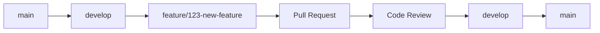
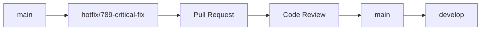

# Git Conventions & Workflow

## 📋 Overview

This document outlines the Git conventions and workflow practices for the IoT Admin Service API project. Following these conventions ensures consistent code history, clear communication, and efficient collaboration among team members.

## 🏷️ Commit Message Convention

### Format
```
<type>(<scope>): <subject>

<body>

<footer>
```

### Type Categories

| Type | Description | Example |
|------|-------------|---------|
| `feat` | New feature | `feat(auth): add two-factor authentication` |
| `fix` | Bug fix | `fix(device): resolve device credential validation issue` |
| `docs` | Documentation changes | `docs(api): update swagger documentation` |
| `style` | Code style changes (formatting, etc.) | `style: format code with gofmt` |
| `refactor` | Code refactoring | `refactor(user): extract user validation logic` |
| `test` | Adding or updating tests | `test(service): add unit tests for user service` |
| `chore` | Maintenance tasks | `chore(deps): update dependencies` |
| `perf` | Performance improvements | `perf(query): optimize database queries` |
| `ci` | CI/CD changes | `ci: add GitHub Actions workflow` |
| `build` | Build system changes | `build: update Docker configuration` |
| `revert` | Revert previous commit | `revert: revert "feat(auth): add 2FA"` |

### Scope Examples

| Scope | Description | Example |
|-------|-------------|---------|
| `auth` | Authentication & authorization | `feat(auth): implement JWT refresh tokens` |
| `user` | User management | `fix(user): resolve user creation validation` |
| `device` | Device management | `feat(device): add device telemetry endpoints` |
| `customer` | Customer management | `refactor(customer): improve customer search` |
| `dashboard` | Dashboard functionality | `feat(dashboard): add widget bundle import/export` |
| `api` | API endpoints | `docs(api): update endpoint documentation` |
| `db` | Database changes | `fix(db): resolve migration issue` |
| `deps` | Dependencies | `chore(deps): update Go modules` |

### Subject Guidelines

- **Use imperative mood**: "add" not "added" or "adds"
- **Keep it concise**: 50 characters or less
- **Start with lowercase**: No capital letters
- **No period at the end**: End without punctuation

### Body Guidelines

- **Explain the "why"**: Not just "what" was changed
- **Wrap at 72 characters**: For readability
- **Use present tense**: "This change..." not "This changed..."

### Footer Guidelines

- **Breaking changes**: Start with `BREAKING CHANGE:`
- **Issue references**: `Closes #123`, `Fixes #456`
- **Co-authored-by**: For collaborative commits

### Examples

#### Feature Commit
```
feat(auth): add two-factor authentication support

- Implement TOTP-based 2FA using QR codes
- Add enable/disable 2FA endpoints
- Include backup recovery codes generation
- Add validation for 2FA tokens

Closes #123
```

#### Bug Fix Commit
```
fix(device): resolve device credential validation issue

The device credential validation was failing for devices with
special characters in their names. This fix properly escapes
the device name before validation.

Fixes #456
```

#### Documentation Commit
```
docs(api): update swagger documentation for user endpoints

- Add missing request/response examples
- Include error response documentation
- Update authentication requirements
- Add pagination examples
```

#### Breaking Change Commit
```
feat(api): restructure user endpoints for better organization

BREAKING CHANGE: User endpoints now require customer ID in path
instead of query parameter. Update client code accordingly.

- Move /api/v1/admin/users to /api/v1/admin/customers/{customerId}/users
- Update all related endpoints to follow new pattern
- Add customer validation middleware

Closes #789
```

## 🌿 Branching Strategy

### Branch Types

#### Main Branches

| Branch | Purpose | Protection |
|--------|---------|------------|
| `main` | Production-ready code | ✅ Protected |
| `develop` | Integration branch | ✅ Protected |

#### Feature Branches

| Pattern | Purpose | Example |
|---------|---------|---------|
| `feature/` | New features | `feature/user-management` |
| `bugfix/` | Bug fixes | `bugfix/device-validation` |
| `hotfix/` | Critical production fixes | `hotfix/security-patch` |
| `release/` | Release preparation | `release/v1.2.0` |

### Branch Naming Convention

```
<type>/<ticket>-<description>
```

**Examples:**
- `feature/123-add-user-authentication`
- `bugfix/456-fix-device-credential-validation`
- `hotfix/789-security-vulnerability-patch`
- `release/101-prepare-v1-2-0`

### Branch Lifecycle

1. **Create**: Branch from `develop` for features, `main` for hotfixes
2. **Develop**: Work on your feature/bugfix
3. **Test**: Ensure all tests pass
4. **Review**: Create pull request for code review
5. **Merge**: Merge back to `develop` (features) or `main` (hotfixes)
6. **Delete**: Clean up merged branches

## 🔄 Workflow

### Feature Development Workflow



### Steps

1. **Start Development**
   ```bash
   git checkout develop
   git pull origin develop
   git checkout -b feature/123-new-feature
   ```

2. **Make Changes**
   ```bash
   # Make your changes
   git add .
   git commit -m "feat(scope): add new feature"
   ```

3. **Push and Create PR**
   ```bash
   git push origin feature/123-new-feature
   # Create Pull Request on GitHub/GitLab
   ```

4. **Code Review**
   - Request reviews from team members
   - Address feedback and push updates
   - Ensure CI/CD checks pass

5. **Merge**
   ```bash
   # After approval, merge to develop
   git checkout develop
   git pull origin develop
   git branch -d feature/123-new-feature
   ```

### Hotfix Workflow



### Steps

1. **Create Hotfix Branch**
   ```bash
   git checkout main
   git pull origin main
   git checkout -b hotfix/789-critical-fix
   ```

2. **Fix and Commit**
   ```bash
   # Make critical fix
   git add .
   git commit -m "fix(scope): critical security fix"
   ```

3. **Merge to Main**
   ```bash
   git push origin hotfix/789-critical-fix
   # Create PR to main
   # After approval, merge to main
   ```

4. **Merge to Develop**
   ```bash
   git checkout develop
   git pull origin develop
   git merge main
   git push origin develop
   ```

## 📋 Pull Request Guidelines

### PR Title Convention
```
<type>(<scope>): <description>

Examples:
- feat(auth): add two-factor authentication
- fix(device): resolve credential validation issue
- docs(api): update endpoint documentation
```

### PR Description Template

```markdown
## Description
Brief description of the changes made.

## Type of Change
- [ ] Bug fix (non-breaking change which fixes an issue)
- [ ] New feature (non-breaking change which adds functionality)
- [ ] Breaking change (fix or feature that would cause existing functionality to not work as expected)
- [ ] Documentation update

## Testing
- [ ] Unit tests pass
- [ ] Integration tests pass
- [ ] Manual testing completed
- [ ] All existing functionality works as expected

## Checklist
- [ ] Code follows project style guidelines
- [ ] Self-review of code completed
- [ ] Code is self-documenting
- [ ] No new warnings generated
- [ ] Documentation updated (if applicable)

## Screenshots (if applicable)
Add screenshots for UI changes.

## Related Issues
Closes #123
Fixes #456
```

### Review Guidelines

#### For Reviewers
- **Be constructive**: Provide helpful feedback
- **Check functionality**: Ensure the code works as intended
- **Verify tests**: Ensure adequate test coverage
- **Check documentation**: Verify documentation is updated
- **Consider security**: Look for potential security issues

#### For Authors
- **Respond promptly**: Address review comments quickly
- **Be open to feedback**: Consider suggestions seriously
- **Explain decisions**: Provide context for design choices
- **Update as needed**: Make requested changes

## 🏷️ Versioning

### Semantic Versioning (SemVer)

Format: `MAJOR.MINOR.PATCH`

- **MAJOR**: Breaking changes
- **MINOR**: New features (backward compatible)
- **PATCH**: Bug fixes (backward compatible)

### Version Bumping

| Change Type | Version Bump | Branch |
|-------------|--------------|--------|
| Breaking change | MAJOR | `main` |
| New feature | MINOR | `develop` |
| Bug fix | PATCH | `develop` |

### Release Process

1. **Prepare Release**
   ```bash
   git checkout develop
   git pull origin develop
   git checkout -b release/v1.2.0
   ```

2. **Update Version**
   - Update `VERSION` file
   - Update changelog
   - Update documentation

3. **Create Release**
   ```bash
   git commit -m "chore(release): bump version to v1.2.0"
   git push origin release/v1.2.0
   # Create PR to main
   ```

4. **Tag Release**
   ```bash
   git tag -a v1.2.0 -m "Release v1.2.0"
   git push origin v1.2.0
   ```

## 🚫 Git Hooks

### Pre-commit Hook
```bash
#!/bin/sh
# .git/hooks/pre-commit

# Run linter
make lint

# Run tests
make test

# Check commit message format
# (You can add commit message validation here)
```

### Commit Message Hook
```bash
#!/bin/sh
# .git/hooks/commit-msg

# Validate commit message format
# (You can add regex validation here)
```

## 📊 Best Practices

### General Guidelines

1. **Small, Focused Commits**
   - One logical change per commit
   - Easy to review and revert
   - Clear commit history

2. **Descriptive Messages**
   - Explain "why" not just "what"
   - Use present tense
   - Be specific and concise

3. **Regular Commits**
   - Commit frequently
   - Don't let work accumulate
   - Keep commits atomic

4. **Pull Before Push**
   ```bash
   git pull origin <branch>
   git push origin <branch>
   ```

5. **Use Branches**
   - Never commit directly to main/develop
   - Create feature branches for all changes
   - Keep branches short-lived

### Code Review Checklist

- [ ] **Functionality**: Does the code work as intended?
- [ ] **Tests**: Are there adequate tests?
- [ ] **Documentation**: Is documentation updated?
- [ ] **Style**: Does code follow project conventions?
- [ ] **Security**: Are there security implications?
- [ ] **Performance**: Are there performance concerns?
- [ ] **Error Handling**: Is error handling appropriate?
- [ ] **Logging**: Is logging sufficient?

### Conflict Resolution

1. **Prevent Conflicts**
   - Pull frequently
   - Communicate with team
   - Keep branches short-lived

2. **Resolve Conflicts**
   ```bash
   git status  # Check for conflicts
   # Edit conflicted files
   git add <resolved-files>
   git commit -m "fix: resolve merge conflicts"
   ```

## 🔧 Tools and Automation

### Recommended Tools

1. **Git Hooks**: Automate checks
2. **CI/CD**: Automated testing and deployment
3. **Linters**: Code quality checks
4. **Commit Message Validators**: Ensure proper format

### IDE Integration

- **VS Code**: GitLens extension
- **IntelliJ**: Built-in Git support
- **GitHub Desktop**: Visual Git client

## 📚 Resources

- [Conventional Commits](https://www.conventionalcommits.org/)
- [Git Flow](https://nvie.com/posts/a-successful-git-branching-model/)
- [Semantic Versioning](https://semver.org/)
- [Git Best Practices](https://git-scm.com/book/en/v2/Distributed-Git-Contributing-to-a-Project)

---

Following these Git conventions ensures a clean, maintainable codebase with clear history and efficient collaboration among team members. 